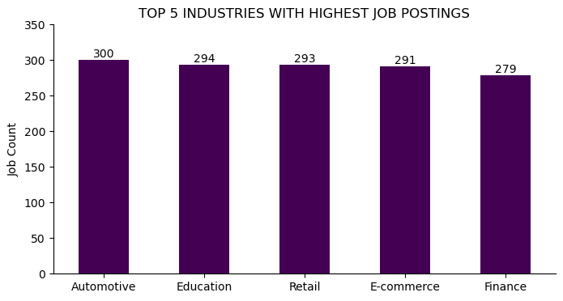
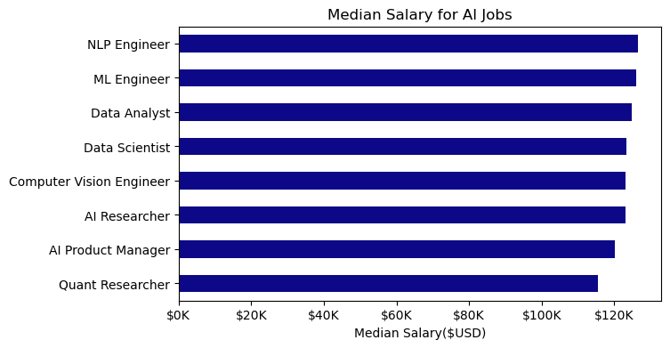
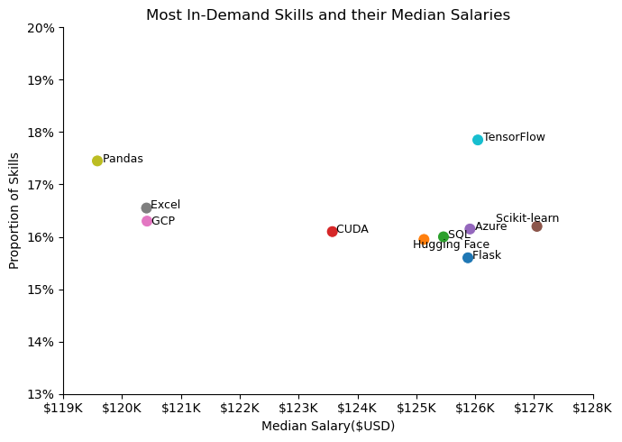
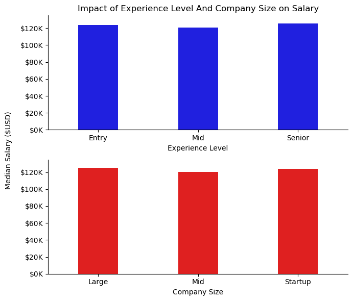
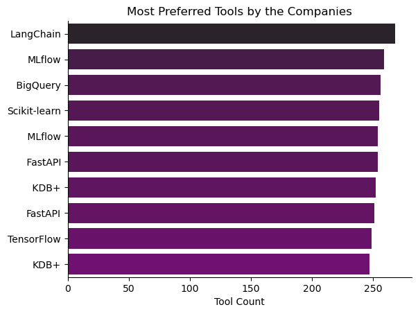
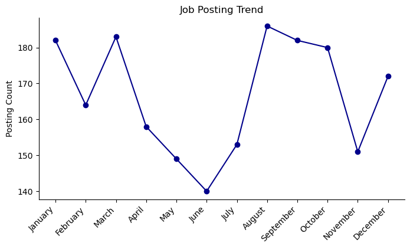

# AI Job Market: Exploratory Data Analysis

[](https://www.python.org/)
[]()

## 📋 Table of Contents
- [Overview](#🎯-overview)
- [Research Questions](#❓-research-questions)
- [Dataset](#📊-dataset)
- [Installation](#🚀-installation)
- [Analysis & Findings](#📈-analysis-and-findings)
- [Technologies Used](#🛠️-technologies-used)
- [Conclusion](#🎯-conclusion)


## 🎯 Overview

The AI job market is rapidly evolving, making it difficult for job seekers and industry leaders to understand the current landscape. This analysis seeks to answer critical questions such as: **What are the most financially rewarding skills?** and **How does compensation vary by experience level and location?**

The primary objective of this project is to conduct a comprehensive **Exploratory Data Analysis (EDA)** on the global Artificial Intelligence job market to extract actionable insights that can guide:
- **Job seekers** in identifying high-demand skills and lucrative career paths
- **Employers** in understanding competitive compensation trends
- **Industry analysts** in tracking market evolution and emerging patterns

## ❓ Research Questions

This analysis investigates six key questions about the AI job market:

1. **Which industry has the most job openings?**
2. **How does the median salary vary for different jobs?**
3. **Which are the top-paying and most in-demand skills?**
4. **Do experience level and company size affect salary?**
5. **What are the most preferred tools by companies?**
6. **How have job postings trended over the months?**

## 📊 Dataset

### Data Source
The dataset used in this analysis is sourced from Kaggle. This synthetic data represents AI-related job postings from sep 2023 to sep 2025 across.

### Dataset Description
- **Size**: 2000 job postings
- **Time Period**: Sep 2023 to Sep 2025
- **Last Updated**: Nov 2025

### Key Features
The dataset includes the following attributes:

| Feature | Description | Data Type |
|---------|-------------|-----------|
|`job_id` | Unique Id | Int |
| `company_name` | Hiring company | String |
| `industry` | Industry sector | Categorical |
| `job_title` | Job position title | String |
|`skills_required` | Required skills | List |
| `experience_level` | Required experience (Entry/Mid/Senior) | Categorical |
|`employment_type` | (Full-time, Contract, Remote, Internship) | Categorical |
| `location` | Job location (city/country) | String |
| `median_salary` | Job salary | Int |
| `posted_date` | Date job was posted | DateTime |
| `company_size` | Organization size (Startup/Mid/Large) | Categorical |
| `tools_preferred` | Preferred tools/technologies | List |


### Data Preprocessing
- Converted date fields to datetime format
- Converted skill fields and tools from string to list
- Removed duplicate job postings
- Filtered outliers in salary data

### Data Limitations

#### 1. No Real-World Validity

Data does not represent actual job market conditions
Findings cannot be used for real business decisions or career planning
Patterns observed are artifacts of the generation process, not market realities


#### 2. Simplified Relationships

Correlations between variables (e.g., skills and salary) are predetermined by generation logic
Real-world complexities, irregularities, and exceptions are not captured
Missing nuanced interactions between multiple factors


#### 3. Lack of Market Dynamics

Does not reflect actual supply-demand economics
Temporal trends are simulated and may not match real seasonal patterns
Cannot capture sudden market shifts, economic events, or industry disruptions


#### 4. Artificial Distributions

Statistical distributions may not match real-world data patterns
Outliers and edge cases may be under-represented or over-simplified
Variance in data may be artificially constrained


#### 5. No Geographic Accuracy

Location-based salary differences are estimated, not based on actual cost of living
Regional industry concentrations may not reflect reality
Cultural and regulatory factors affecting employment are not modeled


#### 6. Skills and Tools Bias

Skill combinations may not reflect actual job requirements
Tool preferences are based on assumptions, not employer data
Emerging technologies and skills may be missing


#### 7. Temporal Validity

Data does not capture current market conditions
Cannot be used to predict future trends
No reflection of recent industry events or technological shifts


#### 8. Sampling Bias

May over-represent or under-represent certain job types, industries, or experience levels
Distribution across categories may not match real market proportions
Missing representation of niche roles or emerging positions

## 🚀 Installation

### Prerequisites
- Python 3.8 or higher
- conda package manager

### Setup Instructions

1. **Create a conda environment**
```bash
conda create -n ai-job-market python=3.11
conda activate ai-job-market
```

2. **Install required packages** 
```bash
conda install -c conda-forge pandas numpy matplotlib seaborn  jupyter 
```

3. **Alternative: Using pip with conda environment**
```bash
pip install -r requirements.txt
```

### Required Dependencies
```
pandas>=1.5.0
numpy>=1.23.0
matplotlib>=3.6.0
seaborn>=0.12.0
jupyter>=1.0.0
```


## 📈 Analysis and Findings


**1. Industry Distribution**



### Key Insights:

- The **Automotive industry** leads with 300 AI job postings, indicating strong investment in AI for autonomous vehicles, manufacturing automation, and supply chain optimization
- Job postings are relatively evenly distributed across the top 5 industries (279-300 range), suggesting widespread AI adoption
- Traditional sectors like Education and Retail show significant AI integration, not just tech-native industries
- The narrow distribution gap (21 jobs between #1 and #5) indicates broad market maturity in AI adoption

**2. Salary Analysis**



### Key Insights:

- **Target Highest Compensation:** Job seekers aiming for maximum pay should prioritize roles as **NLP Engineer and ML Engineer**, as these positions command the highest median salaries (just over $120K USD), indicating the market's high value for specialization in natural language processing and core machine learning model development.

- **Minimal Salary Compromise:** Organizations can expect minimal cost savings when swapping highly technical roles. The salary difference between the highest-paid specializations (NLP/ML Engineer) and the generalist roles (Data Analyst, Data Scientist) is negligible, suggesting that **all critical AI roles require substantial investment.**

- **Broad Market Value:** The tight clustering of salaries for roles like **Data Scientist, Computer Vision Engineer, AI Researcher, and AI Product Manager** (all near $120K - $125K USD) demonstrates that the market places a consistently high and equitable value on a wide array of core AI and strategic product development skills.

- **Career Switch Viability:** Individuals in the Quant Researcher role, which has the lowest median salary on this chart (just above $110K USD), may find a direct transition into any of the other listed AI engineering or management positions financially rewarding, with a potential salary increase of up to ~10% simply by moving into a different AI specialization.

**3. In-Demand Skills**
#### Code snippet:
```python
# Using a scatter plot for visualization
plt.figure(figsize=(7, 5)) # A wider figure gives more room on the sides
ax = sns.scatterplot(data = df_plot, x = 'median_salary', y = 'skill_perc', s = 90, hue = 'skill_perc', palette = 'tab10', legend =False)

# Customizing visualization
sns.despine()

texts = []

for i, skill in enumerate(skill_name):
    texts.append(plt.text(sal_list[i], perc_list[i] , skill, fontsize = 9))

# Adjusting text label
from adjustText import adjust_text

adjust_text(
    texts, 
    force_text=5.0,    
    force_points=2.0,   
)

ax.set_title('Most In-Demand Skills and their Median Salaries')
ax.set_xlim(119000,128000)
ax.set_xlabel('Median Salary($USD)')
ax.set_ylabel('Proportion of Skills')
ax.set_ylim(13,20)
ax.xaxis.set_major_formatter(plt.FuncFormatter(lambda x,pos : f'${int(x/1000)}K'))
ax.yaxis.set_major_formatter(plt.FuncFormatter(lambda y,pos : f'{int(y)}%'))
plt.tight_layout()
plt.show()
```
**Visualization:**



### Key Insights:

- **TensorFlow** Dominates Compensation and Demand: The skill associated with the highest median salary is Scikit-learn (around $127.5K USD). However, TensorFlow demonstrates a strong combination of high compensation (around $126K USD) and the highest demand, with a skill proportion of approximately 18%.

- **Low-Salary, High-Demand Foundation Skills:** Pandas and Excel are the most frequently demanded skills (around 17.5% and 16.5% proportion, respectively), but they correlate with the lowest median salaries (around $119.5K USD and $120.5K USD). This suggests they are foundational skills that are necessary but not sufficient to command the highest compensation.

- **The High-Value Cluster:** A tight cluster of specialized skills—including Scikit-learn, Azure, SQL, Flask, Hugging Face, and CUDA—all correlate with high median salaries, ranging narrowly from approximately $123.5K USD to $127.5K USD. This indicates that mastering any of these specialized tools significantly increases earning potential.

- **GCP is an Outlier in Demand vs. Pay:** GCP (Google Cloud Platform) has a relatively high proportion of demand (around 16.3%), placing it closer to foundational tools like Excel, but it correlates with a median salary that is barely above Excel, suggesting that its cloud-specific value isn't as highly compensated as competing cloud skills like Azure (which correlates with a higher salary).

**4. Experience & Company Size Impact**

**code snippet:**
```python
# Creating new dataframes to find how the experience level and company size impact salary
df_exp_lvl = df_cleaned.groupby('experience_level')['median_salary'].median().to_frame()
df_com_size = df_cleaned.groupby('company_size')['median_salary'].median().to_frame()

# Using a barplot for visualization
fig, ax = plt.subplots(2,1, figsize = (7,6))
sns.barplot(data = df_exp_lvl, x = 'experience_level', y = 'median_salary', ax= ax[0], color = 'blue', width = 0.4)
sns.barplot(data = df_com_size, x = 'company_size', y = 'median_salary', ax= ax[1], color = 'red', width = 0.4)
sns.despine()

# Customizing the visualization
ax[0].set_ylim(0,135000)
ax[1].set_ylim(0,135000)
ax[0].set_ylabel('')
ax[1].set_ylabel('')
ax[0].set_xlabel('Experience Level')
ax[1].set_xlabel('Company Size')
ax[0].yaxis.set_major_formatter(plt.FuncFormatter(lambda y,pos: f'${int(y/1000)}K'))
ax[1].yaxis.set_major_formatter(plt.FuncFormatter(lambda y,pos: f'${int(y/1000)}K'))
fig.supylabel('Median Salary ($USD)', fontsize=10)
ax[0].set_title('Impact of Experience Level And Company Size on Salary')
plt.tight_layout()
plt.show()
```
**Visualization:**



### Key Insights:
#### 💼Experience Level Impact (Top Chart)
- **Experience Provides Minimal Pay Bump:** There is virtually no significant median salary difference across Entry, Mid, and Senior experience levels. All three levels are tightly clustered around the $120K to $123K USD mark.

- **Focus on Role/Skills Over Title:** Job seekers should understand that simply achieving a "Senior" title may not translate into significantly higher compensation compared to an "Entry" role. Salary negotiations should therefore prioritize the specific high-value skills (as seen in the other chart, e.g., Scikit-learn or TensorFlow) rather than relying on experience level alone.

- **High Starting Salary:** The high median salary for Entry-level positions (around $122K USD) suggests a fiercely competitive market where companies must offer high compensation even for beginners in the AI/data science field.

#### 🏢 Company Size Impact (Bottom Chart)
- **Company Size is Not a Salary Differentiator:** The median salary is nearly identical across Large, Mid-sized, and Startup companies, all clustering around the $122K to $123K USD range.

- **Decision Criterion Shift:** Candidates should not use potential compensation as a primary factor when choosing between company sizes. Instead, the decision should be driven by cultural fit, pace of work, potential for equity/bonuses (which are not median salary), and career development opportunities.

- **Startups Offer Competitive Pay:** Startups offer a median salary that is directly competitive with large, established companies, indicating that they are fully aware of the market rate and must match it to attract top AI talent.

**5. Tool Preferences**

**code snippet:**
```python
# Exploding the tools_preferred column 
df_tools_explode = df_cleaned.explode('tools_preferred')

# Finding the top 10 most preferred tools by companies
df_tools = df_tools_explode['tools_preferred'].value_counts().head(10).reset_index(name = 'tool_count')

# Plotting horizontal bar chart using seaborn
sns.barplot(data =  df_tools, x = 'tool_count', y = 'tools_preferred', hue = 'tool_count', palette = 'dark:purple_r', legend =False)
sns.despine()

# Customizing the visualization
plt.title('Most Preferred Tools by the Companies')
plt.ylabel('')
plt.xlabel('Tool Count')
```
**Visualization :**



### Key Insights:
- **Python is Non-Negotiable:** At nearly **95%** preference, Python is the indispensable, mandatory foundation for all AI/Data Science work.

- **LLMs are the Next Priority:** **LangChain** is the second most preferred tool (approx. 30%), signaling a major market focus on building practical Large Language Model (LLM) applications.

- **Specialized Support:** **SQL (20%) and R (15%)** maintain relevance as support tools for specific needs like data access and deep statistical modeling.

- **Niche Tooling is Minimal:** Highly specialized platforms like KDB+ (5%) confirm their role is limited to highly specific, low-latency environments (e.g., finance), with little relevance to the general market.

**Temporal Trends**

**code snippet:**
```python
# Finding the job posting count for each month
df_month = pd.to_datetime(df_cleaned['posted_date']).dt.month_name().value_counts().reset_index()
df_month['date_object'] = pd.to_datetime('1-' + df_month['posted_date'], format='%d-%B')
df_month['month_no'] = pd.to_datetime(df_month['date_object']).dt.month
df_month.drop(columns ='date_object', inplace =True)
df_month.sort_values(by = 'month_no', inplace = True)
df_month.set_index('posted_date')

# # Plotting line chart for visualization
ax = df_month.plot(kind = 'line', x = 'month_no', y = 'count', figsize = (8,4), legend = False, marker='o', color = 'darkblue')
sns.despine()

# Customizing Visualization
ax.set_xticks(df_month['month_no'])
ax.set_xticklabels(df_month['posted_date'].str[:])
plt.xticks(rotation = 45, ha = 'right')
plt.title('Job Posting Trend')
plt.xlabel('')
plt.ylabel('Posting Count')
plt.show()
```
**Visualziation :**



### Key Insights:
- **Peak Hiring Season:** The highest volume of job postings occurs during the late summer and early fall months, with the **August** peak showing the highest count of the entire year. This suggests the optimal time for job searching is leading up to or during this period.

- **Mid-Year Low Point:** Job posting activity hits its absolute annual low in June. This dip represents the period where the market for new roles is thinnest, likely due to budget finalization and the start of summer vacation periods.

- **Consistent Quarter-End Activity:** Hiring generally starts strong in the first quarter (Q1), peaking in March, and then experiences a significant surge in the third quarter (Q3). This trend suggests companies often allocate and post roles following fiscal quarter planning cycles.

- **Year-End Activity Rebound:** Following a minor dip in November, there is a distinct rebound in December posting volume. This late surge may be driven by companies trying to spend remaining budgets or secure talent before the start of the new year.

*[Click here](AI_jobs_data_EDA\AI_jobs_analysis.ipynb) to see the full Analysis*

## 🛠️ Technologies Used

- **Python 3.11** - Core programming language
- **Pandas** - Data manipulation and analysis
- **NumPy** - Numerical computations
- **Matplotlib & Seaborn** - Static visualizations
- **Jupyter Notebook** - Interactive development environment


## 🎯 Conclusion
- **Skills Drive Pay, Not Title/Size:** Median salary is flat across all experience levels and company sizes ($\approx \$122K$ USD), meaning technical specialization (especially Scikit-learn and TensorFlow) is the only reliable path to maximizing compensation.

- **LLM Deployment is the Top Focus:** The overwhelming preference for LangChain (the most preferred tool) signals that the market's most immediate and critical need is for engineers capable of integrating and deploying Large Language Models (LLMs).

- **Targeted Top Compensation:** For the highest pay, individuals should pursue NLP Engineer or ML Engineer roles and ensure they have the associated high-value skills like TensorFlow (high demand) or Scikit-learn (highest salary correlation).

- **Best Time to Search:** Job seekers should concentrate their efforts between August and October, which represents the peak hiring season for job postings.

- **High-Demand Industries:** Job searches should primarily focus on the Automotive, Education, and Retail sectors, which currently show the highest volume of AI-related job postings.

---

**Note**: This is an educational/research project. The findings should be interpreted within the context of the data limitations and methodology described above.

*Last Updated: 23-11-2025*